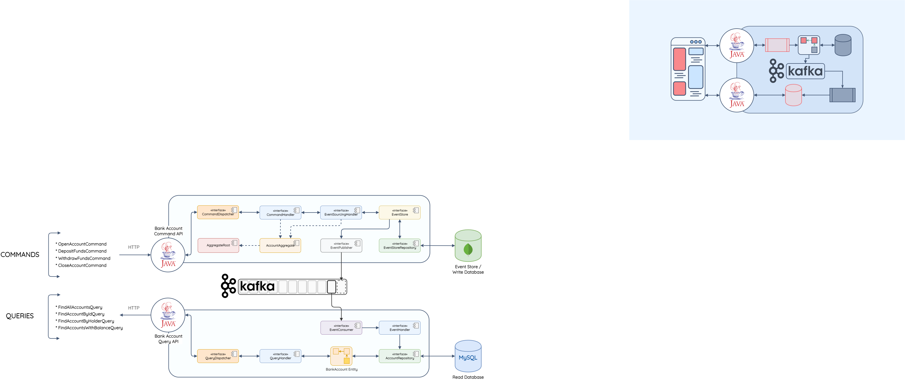

# Bank Application

Tried to backend of simple bank application using CQRS and Event sourcing microservice design pattern

As CQRS contains two part command and query part, this repo also contain both services, command and query part

#### Overview
Command Service exposes four commands
1. OpenBankAccount
2. CloseBankAccount
3. Deposit fund
4. Withdraw funds

each of these commands raise event and this event is stored in Event store and then put into Kafka publisher.

Kafka consumer on Query services consumes this and execute this event and stores in Read Database

#### Database
1. MongoDB for event store
2. MYSQL for read db

why MongoDB for event store? since our application is write heavy than read heavy, since there should be minimal latency and system should be consistent, felt mongodb is better for this one
and for read db, MYSQL would be fine

#### Architecture overview

API
Command
1. Open Account
Type: POST

URL: http://localhost:8080/api/v1/openBankAccount

Body:

``
   {
   "accountHolder": "New John Doe",
   "accountType": "SAVINGS",
   "openingAmt": 100
   }
``

2. Close Account
   Type: DELETE

URL: http://localhost:8080/api/v1/closeFund/{id} -> you can get this id from mysql db of any account

Body:

``
``

3. Deposit Funds
   Type: PUT

URL: http://localhost:8080/api/v1/depositeFunds/{id}

Body:

``
{
"depositBalance": 100
}
``

4. Withdraw Account
   Type: PUT

URL: http://localhost:8080/api/v1/withDrawFunds/{id}

Body:

``
{
"withDrawAmount": 100.0
}
``

Query:
1. Get All account
   Type: GET

URL: http://localhost:8082/api/v1/accountLookup/

2. Get account by Id
   Type: GET

URL: http://localhost:8082/api/v1/accountLookup/byId/{id}

3. Get account by name
   Type: GET

URL: http://localhost:8082/api/v1/accountLookup/byHolder/{nameOfAccountHolder}
sample -> http://localhost:8082/api/v1/accountLookup/byHolder/John Doe

4. Get All accounts by balance
   Type: GET

URL: http://localhost:8082/api/v1/accountLookup/byBalance/{EqualityType}/{amount}
EqualityType : {GREATER_THAN, LESS_THAN}
amount: 100, 1

#### Run
1. run compose file by running docker-compose up -d
2. then clone this repo, build all repo, then CommanApplication.java, and then QueryApplication.java

Note: This is repo is part of learning, all the contents are from UDEMY course, course name: Java Microservices : CQRS & Event sourcing using from Kafka by Sean Campbell
